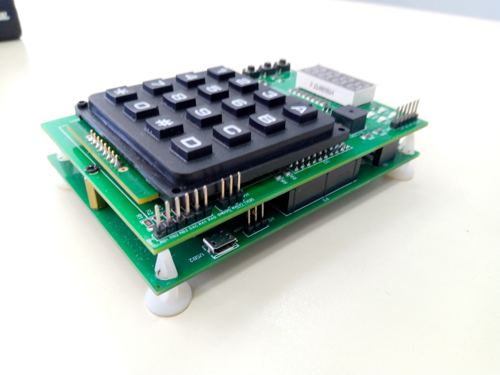
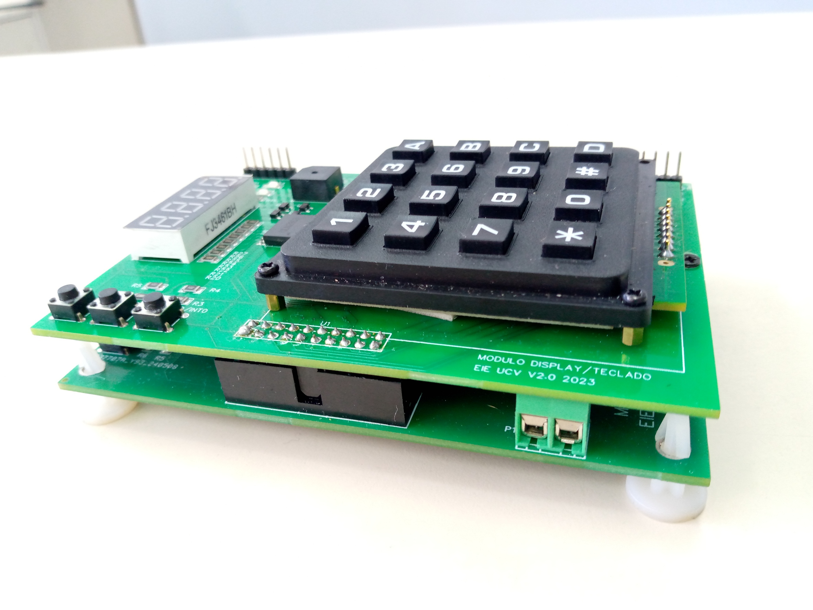
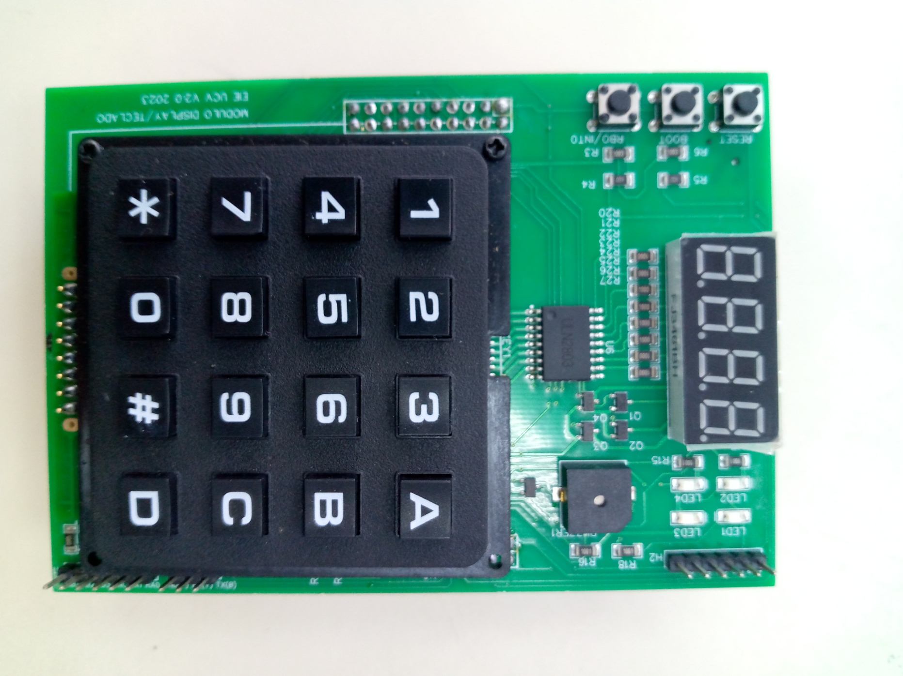

<h1>Here are the main assignment statements and files.</h1>
<h2>Practices: </h2>
<ol>
    <li>Counter of 1's in an arrangement.</li>
    <li>LED flashing.</li>
    <li>Introduction to interruptions and timers</li>
    <li>Counter with display and serial communication</li>
    <li>Operation of matrix type keyboards with the PIC18F45K50</li>
</ol>

<h2>Projects: </h2>
<ol>
    <li>4 bit counter.</li>
    <li>Acces control device consisting of a keyboard, a screen and a PIC18F45K50 microcontroller.</li>
    <li>Sine wave generator composed of a keyboard, a screen and a PIC18F45K50 microcontroller.</li>
</ol>

The program used for serial communication is Docklight in version 2.4

  
  
  